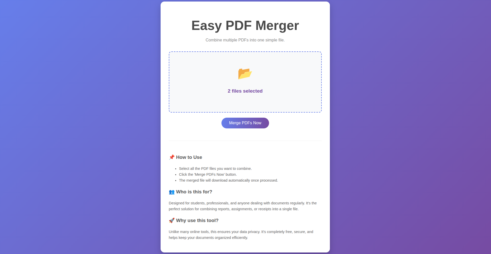

# 📄 Easy PDF Merger

A simple, secure, and powerful Full-Stack web application to merge multiple PDF files into one. Built with **React** (Vite) for the frontend and **FastAPI** (Python) for the backend.


## 🚀 Features

* **Drag & Drop Interface:** Easily upload files by dragging them into the browser.
* **Fast Processing:** Powered by FastAPI for high-performance merging.
* **Privacy Focused:** Files are processed in-memory and are never permanently stored on the server.
* **Modern UI:** Clean and responsive design using CSS gradients and Flexbox.

---

## 🛠️ Tech Stack

* **Frontend:** React.js, Vite
* **Backend:** Python, FastAPI, PyPDF2
* **Tools:** Uvicorn, NPM

---

## ⚙️ Installation & Run Guide

Follow these steps to run the application locally on your machine.

### 1. Prerequisites
Make sure you have the following installed:
* [Python](https://www.python.org/)
* [Node.js](https://nodejs.org/)

---

### 2. Clone the Repository
```bash
git clone https://github.com/sbashar04/pdf-merger.git
cd pdf-merger
````

---

### 3. Setup Backend (Python)

Open a terminal, navigate to the `backend` folder, and install the dependencies.

```bash
cd backend
pip install fastapi "uvicorn[standard]" python-multipart pypdf2
```

**Run the Server:**

```bash
# Option A (Standard)
uvicorn main:app --reload

# Option B (If 'uvicorn' command is not found)
python3 -m uvicorn main:app --reload
```

*The backend will start at: `http://127.0.0.1:8000`*

-----

### 4\. Setup Frontend (React)

Open a **new terminal**, navigate to the `frontend` folder, and install dependencies.

```bash
cd frontend
npm install
```

**Run the Client:**

```bash
npm run dev
```

*The frontend will start at: `http://localhost:5173` (or similar)*

-----

## 📖 How to Use

1.  Keep both terminals (Backend & Frontend) running.
2.  Open your browser and go to `http://localhost:5173`.
3.  Click the box to select PDFs or Drag & Drop them.
4.  Click **"Merge PDFs Now"**.
5.  The merged file will automatically download to your computer.

-----

## 🛡️ License

This project is open-source and free to use.
